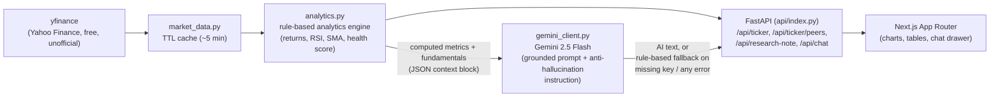

# Equity Research Copilot


> **Disclaimer: Educational project. Not investment advice.** All data is
> sourced from the free, unofficial `yfinance` wrapper around Yahoo Finance
> and may be delayed, incomplete, or inaccurate. AI-generated commentary
> (when a `GEMINI_API_KEY` is configured) is grounded strictly in the
> numbers computed by this app and explicitly instructed never to invent
> figures — but it is still not financial advice.

A zero-cost, finance + AI/LLM portfolio project built by **Gursimran Kaur**
(Data Analyst) to demonstrate: quantitative equity analytics engineering,
API design, LLM-grounding / anti-hallucination prompt design, and a
production-shaped full-stack app (FastAPI + Next.js) deployable on Vercel's
free tier.

## The pitch

Enter any ticker (US or NSE India via the `.NS` suffix) and get:

- 1-year price history with 50/200-day SMA overlay, computed technicals
  (RSI, volatility, max drawdown, trailing returns)
- Key fundamentals (P/E, P/B, market cap, margins, ROE, growth)
- A rule-based **composite health score (0-100)** with a fully documented,
  transparent formula (see [`docs/ARCHITECTURE.md`](docs/ARCHITECTURE.md))
- Peer comparison against a hardcoded sector peer set (or your own tickers),
  with an inline heat-shaded ratio table
- An optional AI-generated research note and follow-up chat, powered by
  Google's free-tier **Gemini 2.5 Flash** — grounded so it can only use the
  numbers computed by the app, with a rule-based fallback when no API key is
  configured or the AI call fails

## Architecture



## Tech stack

- **Backend**: Python 3.14, FastAPI, `yfinance`, pandas, numpy,
  `google-generativeai` (Gemini 2.5 Flash), pytest
- **Frontend**: Next.js 16 (App Router, TypeScript), Tailwind CSS v4,
  shadcn/ui (base-ui primitives), Recharts
- **Hosting**: Vercel (hybrid `@vercel/python` serverless function +
  `@vercel/next` static/SSR frontend)

## Local setup

### Backend

```bash
cd equity-research-copilot
pip install --user -r requirements.txt
# optional: set GEMINI_API_KEY for AI-generated notes/chat
# copy .env.example to .env and fill in, or export directly
uvicorn api.index:app --reload --port 8000
```

Run tests (no network required):

```bash
pytest tests/ -v
```

### Frontend

```bash
cd equity-research-copilot/app
npm install
npm run dev
```

Visit `http://localhost:3000`. The frontend calls the API at
`NEXT_PUBLIC_API_BASE` (defaults to `http://localhost:8000`); copy
`.env.local.example` to `.env.local` to override.

## Deploying to Vercel

See [`docs/DEPLOYMENT.md`](docs/DEPLOYMENT.md) for the full walkthrough,
including getting a free `GEMINI_API_KEY` from
[aistudio.google.com](https://aistudio.google.com) and caveats around
`yfinance` reliability on serverless.

## Docs

- [`docs/PRD.md`](docs/PRD.md) — problem statement, goals, non-goals
- [`docs/ARCHITECTURE.md`](docs/ARCHITECTURE.md) — data flow, API contract,
  exact health-score formula, Gemini grounding strategy, caching
- [`docs/DATA.md`](docs/DATA.md) — data source details and limitations
- [`docs/DEPLOYMENT.md`](docs/DEPLOYMENT.md) — Vercel deploy steps
- [`memory/DECISIONS.md`](memory/DECISIONS.md) — ADR-style build decisions
- [`memory/GLOSSARY.md`](memory/GLOSSARY.md) — plain-language glossary
- [`memory/JOURNAL.md`](memory/JOURNAL.md) — build journal (what actually
  happened, verified network/tooling results)
- [`notebooks/`](notebooks/) — metrics validation and prompt-engineering
  notebooks

## Screenshots

_Placeholder — add screenshots of the ticker search view, health score
panel, peer comparison table, and research note / chat drawer here once
deployed._

## Disclaimer

This project is for educational and portfolio purposes only. It is **not**
investment advice, and nothing it outputs (rule-based or AI-generated)
should be used to make real financial decisions.
